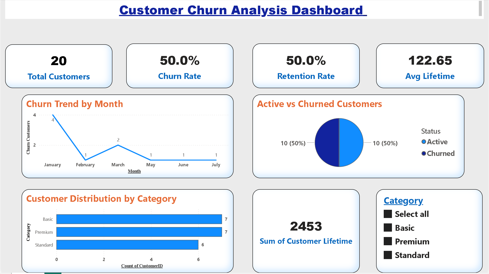

# FUTURE_DS_02
Customer Churn Analysis Dashboard built using Power BI to analyze retention and churn patterns. Includes KPIs like total customers, churn rate, retention rate, and average lifetime, providing insights into customer behavior and supporting data-driven decisions.

# Task 2: Customer Churn Analysis

This project showcases a Customer Churn Analysis Dashboard developed as part of my internship Task 2. The dashboard provides meaningful insights into customer behavior, retention trends, and churn patterns using interactive visualizations.

## 🔹 Key Features:
- KPI cards displaying Total Customers, Churn Rate, Retention Rate, and Average Customer Lifetime  
- Monthly churn trend analysis to identify customer drop patterns  
- Active vs Churned customer distribution visualization  
- Category-wise customer distribution analysis  
- Customer lifetime analysis for better business understanding  
- Interactive slicer for dynamic filtering by category  

## 🛠 Tools & Technologies:
- Power BI  
- Microsoft Excel  

## 📌 Dataset:
The dataset contains customer-related information such as Customer ID, Join Date, Last Active Date, Status (Active/Churned), Category, and Customer Lifetime.

## 📊 Insights Gained:
- Identified churn trends over time  
- Compared active vs churned customers  
- Analyzed customer distribution across categories  
- Evaluated average customer lifetime  

## 📷 Dashboard Preview:

## 📁 Files Included:
- Customer_Churn_Dashboard.pbix  
- customer_data.xlsx  
- dashboard.png  

## 🎯 Conclusion:
This dashboard enhances decision-making by providing a clear understanding of customer retention and churn behavior. It demonstrates practical application of data visualization, analysis, and storytelling using Power BI.
